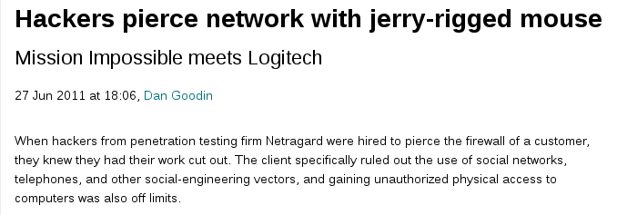
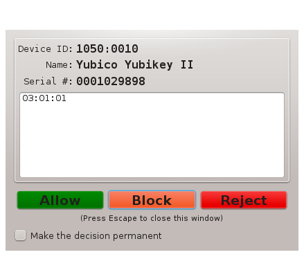
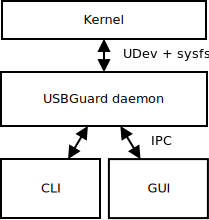

title: USBGuard -- Take control over your USB devices
author:
  name: Daniel Kopeček 
  url: https://github.com/dkopecek/usbguard
output: slides.html
controls: true
theme: sudodoki/reveal-cleaver-theme

--

# USBGuard
## take control over your USB devices

_Daniel Kopeček_

--

### From The News (year 2011)



--

### USBGuard: Up and running/protecting in 1 minute (or so...)

```
# dnf install usbguard usbguard-applet-qt
# usbguard generate-policy > /etc/usbguard/rules.conf
# systemctl start usbguard
$ usbguard-applet-qt &

```


--

### USBGuard: Components



* A firewall-like system for whitelisting and blacklisting USB devices based on their attributes

--

### Attack vectors: Where can USBGuard help?

* USB sticks are usually infected with a malware that relies on the user to run it or on some autorun feature of the system
  * Solution? Disable autorun, educate users
* **Rogue USB devices** that simulate keystrokes, mouse operations or even a network card with a dhcp server already exist
  * Teensy, USBdriveby, ... Cost? ~$20

--

### Attack vectors: Where can USBGuard help?

* **Reprogramming** of USB devices is possible without special hardware: BadUSB
* **Bugs in USB drivers**
* **Usability vs. Security**: physically blocking USB ports is not always desirable 

--

### Advanced and planned features

* Rule conditions
* USB I/O monitoring (in progress)
* Signing devices (?), network-bound encryption
* Better UI for the applet (hopefully with help from a UX designer ;-)
* (your feature or idea)

--

### Limitations

* Cloning devices, faking attributes, ...
* vendor-specific drivers
* USB keyboards usually don't provide a unique serial number, so it's much easier to bypass the policy if you know the vendor and model.

--

### Thank you for listening! Questions?

* Feedback, suggestions and contributions are highly appreciated!
* See known issues, RFEs at https://github.com/dkopecek/usbguard/issues

--

### APPENDIX: Anatomy Of A Rule

--

### APPENDIX: Policy Examples

* Allow a specific Yubikey device to be connected via a specific port. Reject everything else on that port
```
allow 1050:0011 name "Yubico Yubikey II" serial "0001234567" via-port "1-2" hash "044b5e168d40ee0245478416caf3d998"
reject via-port "1-2"
```
* Play "Russian roulette" with USB devices
```
allow if random(0.1666)
reject
```

--

### APPENDIX: CLI Usage Examples

```
# List devices
> usbguard list-devices
3: allow 1a6c:1234 serial "0000:00:14.0" name "xHCI Host Controller" via-port "usb1" with-interface 09:00:00 hash "fc3bee3af869e4161f36dbb8836b2d53"
4: allow 22f4:1234 name "Integrated Camera" via-port "1-12" with-interface equals { 03:00:04 01:00:04 } hash "876ae5b57907c32e51cf8e33ea4bb6f6"

# List rules
> usbguard list-rules
1: allow 1a6c:1234 serial "0000:00:14.0" name "xHCI Host Controller" with-interface 09:00:00 hash "fc3bee3af869e4161f36dbb8836b2d53"
2: allow 22f4:1234 name "Integrated Camera" via-port "1-12" with-interface equals { 03:00:04 01:00:04 } hash "876ae5b57907c32e51cf8e33ea4bb6f6"

# Append a new rule to allow USB thumb drives via a specific port
> usbguard append-rule 'allow via-port "2-1" with-interface 08:06:50'
5
```

